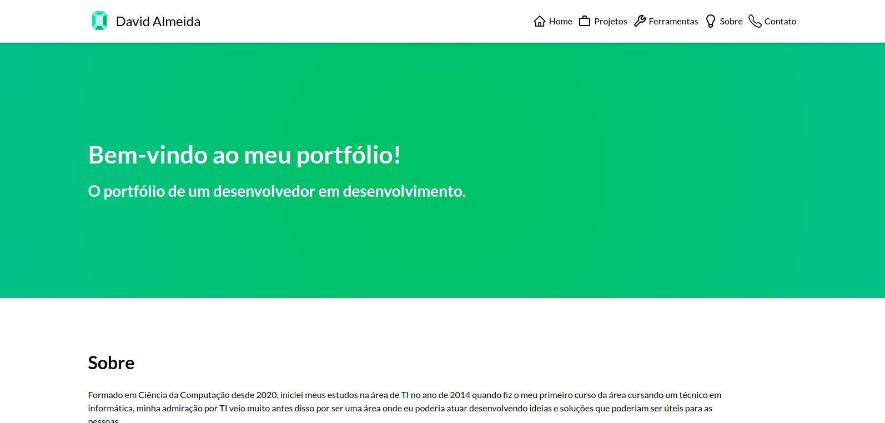

<h1 align="center">Portifólio Web</h1>

<p align="center">
Projeto para reunir técnicas e tecnologias aprendidas em um portifólio feito com React utilizando outras estilizações em branches divergentes.
</p>

<p align="center">
  <a href="#-tecnologias">Tecnologias</a>&nbsp;&nbsp;&nbsp;|&nbsp;&nbsp;&nbsp;
  <a href="#-projeto">Projeto</a>&nbsp;&nbsp;&nbsp;|&nbsp;&nbsp;&nbsp;
  <a href="#-layout">Layout</a>&nbsp;&nbsp;&nbsp;|&nbsp;&nbsp;&nbsp;
  <a href="#memo-licença">Licença</a>
</p>

<p align="center">
  
</p>

<br>

<p align="center">
  
</p>

## 🚀 Tecnologias

Esse projeto foi desenvolvido com as seguintes tecnologias:

- HTML5, CSS3, JS ES6+
- [Node, NPM e JSON](https://nodejs.org/)
- [React](https://reactjs.org/docs/getting-started.html)
- [React-icons](https://react-icons.github.io/react-icons/)
- [React-hot-toast](https://react-hot-toast.com/)
- [React-router-dom](https://reactrouter.com/en/main)
- [Create react-app](https://create-react-app.dev/)
- [Express](https://expressjs.com/)
- [EmailJS](https://www.emailjs.com/docs/examples/reactjs/)

## 💻 Projeto

Projeto destinado a listagem de projetos e habilidades adquiridas ao decorrer do tempo como desenvolvedor web, uma forma de dedicar e reunir também tudo o que foi aprendido criando branches diferentes para criar componentes com outras libs ou técnicas de estilizações.

## 🏡 Executando o projeto

Primeiro faça a instalação das dependências do projeto com o comando

```sh
yarn
```

Este é um projeto simples e se você o clonou em sua máquina para que possa ver ele em execução basta digitar o comando

```sh
yarn start
```

## 🔖 Layout



## 📝 Licença

Esse projeto está sob a licença MIT.

---
